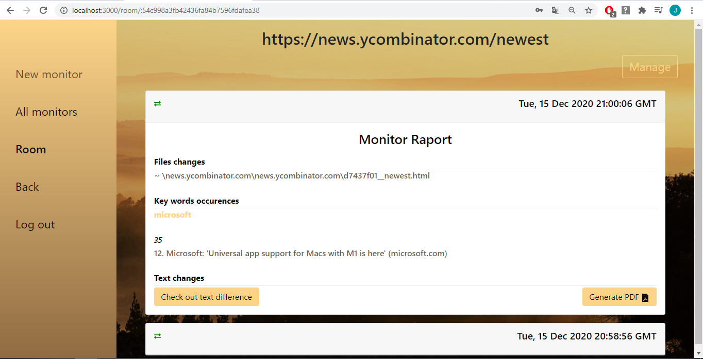

# WebsiteMonitor
A web application that allows to monitor changes on the website or the appearance of the specific keywords.

### Technologies
* *React, TypeScript (frontend)*
* *Flask, Python (backend)*
* *MySQL (database)*
* *Ngnix (proxy server)*

### Functionalities
* signing up and signing in
* cyclic monitoring of changes on the website specified by the user, within a specified time period and time interval
* monitoring the entire website or only selected part of it
* monitoring all website files or only text changes
* observing the results of the scans of the website live (no need to refresh the page)
* sharing the "observation room" with others, even unregistered users, using a long, hard-to-guess link
* immediate notification to the user about a change on the website by e-mail or notification in the web browser
* exporting the changes report as a pdf file

